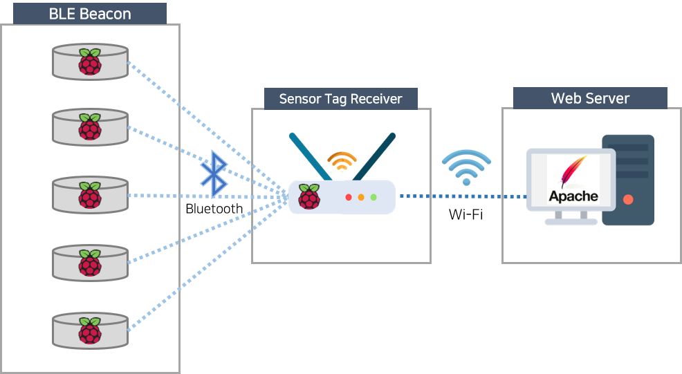
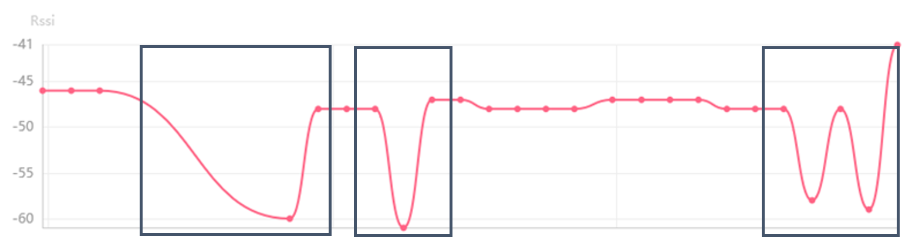
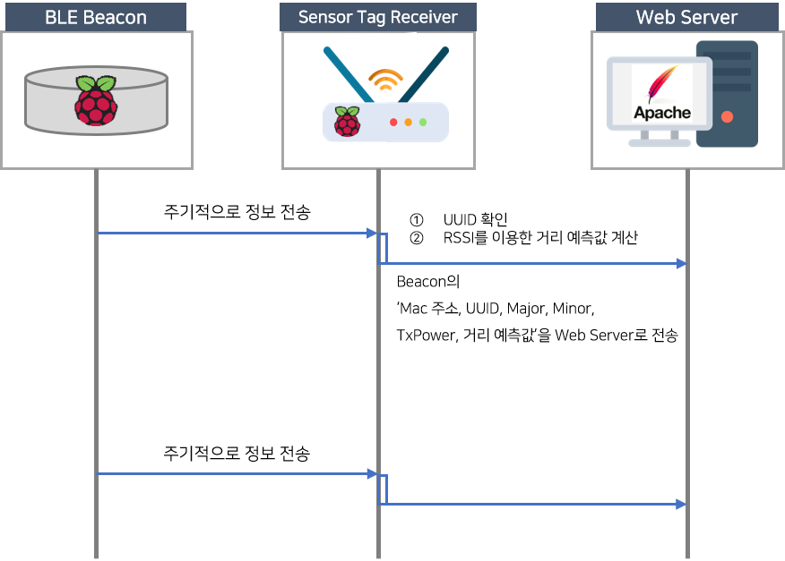
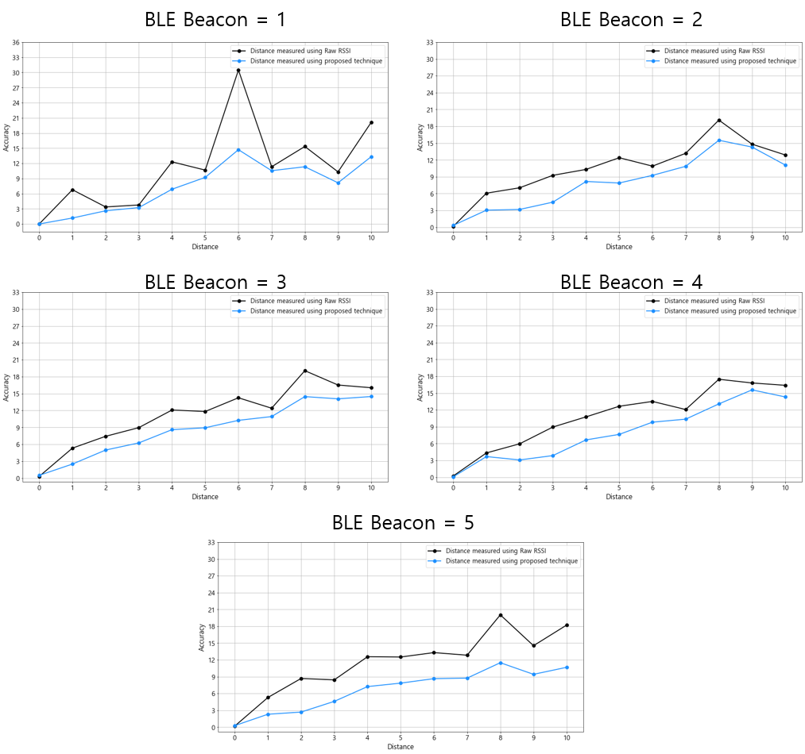

# 저전력 무선 센서 디바이스를 활용한 거리측정 알고리즘
 
Study on BLE Beacon-based Indoor Distance Measurement Technique using Outlier Replacement  

------------------------------------------------------------------------
 

## 개요

본 과제에서는 거리측정 정확도를 개선하기 위해 이상치 보정을 활용한  BLE Beacon 기반의 실내 거리측정 기법을 제안한다. 

제안하는 기법은 1. RSSI 값의 평균 및 표준편차 계산, 2. RSSI 값 이상치 보정, 3. 이동평균 적용, 4. 최종 거리계산으로 구성된다. 

1. 수신된  RSSI 값의 평균과 표준편차를 계산한다. 
2. 수집된 RSSI 값의 최댓값, 최솟값을 고려하여 이상치를 최댓값과 최솟값 중 하나로 대체한다. 
3. RSSI 값에 계산한 이동평균을 적용한다. 
4. 보정된 RSSI 값들과 BLE Beacon 메시지에서 수신된 TxPower를 사용하여 최종 거리측정 결과를 도출한다. 

제안하는 기법의 성능검증을 위해 BLE Beacon의 개수와 거리의 증가를 고려한 실험이 수행되었다. 
실험 결과 제안하는 기법을 적용한 경우가 적용하지 않은 경우보다 54.12% 적은 거리 측정 오차율을 보였다. 
이를 통해 제안하는 기법이 BLE Beacon의 개수 및 환경과 관계없이 거리측정의 정확도를 향상시킬 수 있음을 확인했다.

 

## 시스템 구조

 

## 개발 내용

저전력 무선 센서 디바이스를 활용한 실내 거리측정 기법을 제안한다. 

제안하는 기법의 실효성을 검증하기 위해 저전력 무선 센서 디바이스 및 센서 태그 수신기를 구현한다.

 

- **알고리즘 개발을 위한 데이터 교정**

  

   

1. RSSI 값의 평균 및 표준편차 계산 : MP동안 측정된 RSSI 값들의 평균과 표준편차를 계산하여 각각 저장한다.  
  
2. RSSI 값 이상치 보정 : 최댓값과 최솟값을 설정하여 최댓값보다 크거나 최솟값보다 작은 RSSI 값을 이상치로 판단한다. 이상치로 판단된 RSSI 값이 최댓값보다 큰 경우는 최댓값으로 대체되며 최솟값보다 작은 경우는 최솟값으로 대체된다.  
  
3. 이동평균 적용 : RSSI 값에 이동평균을 적용한다. 이동평균은 기준이 되는 RSSI 값과 이후  w-1개 RSSI 값들의 평균을 구하고, 기준이 되었던 RSSI 값을 계산한 평균값으로 대체한다. 이러한 이동평균은  w번째 RSSI 값부터 다음 RSSI 값으로 이동하며 적용된다.  
  
4. 최종 거리계산에서는 앞서 보정된 RSSI 값들과 BLE Beacon메시지에 포함된 TxPower 값을 사용하여 각각의 거리측정값을 구하고, 그 거리측정값들의 합을 저장한다. 그 다음 합을 통해 평균 거리측정값을 구하고 이를 최종 거리측정 결과로 도출한다. 

  

- **성능 평가** 

  

 
  
BLE Beacon은 Beacon의 고유 정보(universally unique identifier(UUID), Major, Minor, TxPower)를 포함하는 메시지를 주기적으로 전송한다. 

이때 UUID, Major, Minor은 BLE Beacon의 구별을 위한 정보이다. 

UUID는 BLE Beacon이 사용되는 서비스의 정보, Major는 서비스 내의 하위그룹 정보, Minor는 하위그룹 내의 Beacon의 고유 정보다. 즉 메시지의 UUID, Major, Minor 정보를 통해 메시지를 송신한 BLE Beacon을 구별할 수 있다. 한편, TxPower는 BLE Beacon의 송신 세기이며, Beacon Receiver와 BLE Beacon과의 거리측정에 필요한 값이다.  

Beacon Receiver는 RSSI 값의 불안정함을 완화하고 거리측정 정확도를 향상시키기 위해 제안기법을 사용한 거리측정을 수행한다. 

제안기법을 사용한 거리측정은 다음과 같이 동작한다.    
먼저, 미리 정의된 Measurement Period(MP) 동안 RSSI 값을 수집한다. 
그 후 수집된 RSSI 값의 이상치를 보정하고 이동평균을 적용한다. 
마지막으로 RSSI 값을 모두 사용해 다수의 거리 측정값을 계산하고, 계산된 거리측정값들의 평균을 최종 거리측정값으로 도출한다.  
 

- **저전력 무선 센서 디바이스(BLE Beacon) 개발**
  - 싱글보드 하드웨어인 Raspberry pi를 이용하여 저전력 무선 센서 디바이스 개발
  - 무선 센서 디바이스의 고유 ID와 RSSI 값을 이용하며 해당 디바이스의 실시간 위치 파악을 위해 사용
       

- **Beacon Receiver** **개발**
  - 싱글보드 하드웨어인 Raspberry pi를 이용하여  Beacon Receiver 개발
  - Beacon Receiver는 무선 센서 디바이스의 위치 정보를 수신하여 무선 링크를 통해 센서의 정보를 웹 서버로 실시간 전송
       

- **Web Server** **구축**
  - 무선 센서 디바이스의 위치 정보를 저장하기 위한 데이터 베이스와 센서 디바이스 데이터 수신 및 서비스 제공을 위한 웹 서버 구축

 

## 실험 결과 

  
    
  - 그림은 각각 BLE Beacon이 1, 5, 10, 15, 20개 배치되었을 때 0m에서 10m까지의 실제 거리에 따른 거리측정 결과를 보여준다. 
  - 그림에서 배치되는 BLE Beacon의 수가 증가할수록 주변 BLE Beacon이 전송하는 메시지와 충돌할 확률이 높아지기 때문에 거리측정값의 오차가 커지는 모습을 보인다. 
  - 이를 통해 주변 기기로 인한 외부간섭이 발생하는 상황에서 제안하는 기법을 사용하는 것이 사용하지 않는 것보다 더 높은 정확도로 거리를 측정할 수 있음을 확인할 수 있다. 

 

## 결과
- 본 과제에서는 이상치 보정을 활용한 BLE Beacon 기반의 실내 거리측정 기법을 제안했다. 
- 제안하는 기법은 1) RSSI 값의 평균 및 표준편차 계산, 2) RSSI 값 이상치 보정, 3) 이동평균 적용, 4)최종 거리계산으로 구성되었다.
- 제안하는 기법의 성능을 검증하기 위해 실험을 진행했다. 제안하는 기법을 사용한 거리측정은 적용하지 않은 경우와 비교하여 평균 54.12%의 적은 오차율을 보이는 것을 확인했다. 이를 통해 제안하는 기법이 BLE Beacon기반의 거리측정의 정확도를 향상시킬 수 있음을 확인하였다. 
- 또한, BLE Beacon이 각각 5개, 10개, 15개, 20개 배치되었을 때 제안하는 기법을 적용한 경우가 적용하지 않은 경우보다 45.84%, 40.84%, 48.30%, 73.54%의 적은 오차율을 보이는 것을 확인할 수 있었다. 이를 통해 제안하는 기법이 BLE Beacon의 개수에 관계없이 거리측정의 정확도를 향상시킬 수 있음을 확인하였다. 
- 따라서 본 연구를 통해 거리측정 값에 대한 오차의 범위를 줄인다면 실내 PBS 환경에서 더욱 정확한 거리측정이 가능할 것으로 기대된다. 향후, 본 연구의 결과물을 토대로 이동성을 가지는 BLE Beacon에 대한 거리측정 정확도 향상 연구를 수행할 예정이다.

 

## 진행 사항

- **2020년 10월 (진행 완료)**
  - Raspberry Pi 개발환경 세팅, BLE Beacon 구현, Beacon Receiver 구현
  - 수신 데이터 관리를 위한 서버 환경 구축

- **2020년 11월 (진행 완료)**
  - Bluetooth 통신 안정성 확립 및 데이터 수집
  - Receiver와의 Wi-Fi 통신 및 Server 기능 구현

- **2020년 12월 (진행 완료)**
  - Sensor Tag Receiver 구현 완료 
  - 제안하는 거리측정 기법 구현 완료
  - 실험 완료

